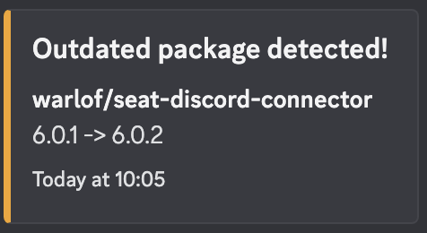

# seat-package-notifications

This plugin sends notifications when core packages or plugins are outdated, so you know when you should update them.

## Installation
The plugin name is `recursivetree/seat-package-notifications` and the [standard plugin installation steps](https://eveseat.github.io/docs/community_packages/) should be enough.

## Configuration
To get notified about outdated plugins, just add the `Outdated Packages/Plugins` notification to a notification group. 
No affiliation is required. 

Per default, notifications are sent out once a day. 
This can be adjusted by changing the schedule for `package-notifications:check`.
